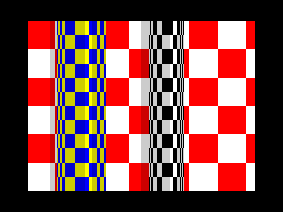

# Roll Me Gently
256 bytes intro (2nd place @Flashparty 2020)
## Tech
* ZX Spectrum 128 (recommended) / 48
* Z80 Assembler ( <=256 bytes executable size)
## Screenshot

## Build instruction
* Use Pasmo to build (compile.sh for MacOS)

## Authors
* **Tomasz Słanina** - [Dox/Joker](https://github.com/tslanina)
## License
This project is licensed under the GPL v3 License - see the [LICENSE](LICENSE) file for details
